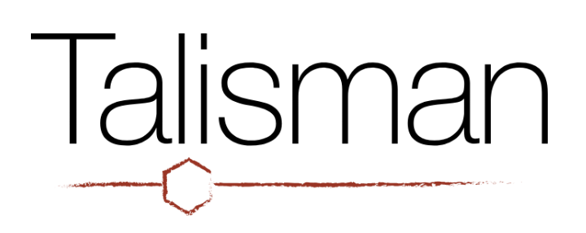

<!--
  Public organisation profile. Keep this limited to information approved for
  public disclosure. The wording below is based on Talisman's public website.
-->

  

# Talisman Therapeutics

**Human cellular neuroscience for neurodegenerative disease drug discovery.**

Talisman Therapeutics develops and applies human stem-cell-based models of
neurodegenerative disease to support target validation, pharmacology and
therapeutic efficacy.

## What we work on

Our human cellular neuroscience platform supports discovery across
neurodegenerative disease, including disease modelling, phenotypic and genetic
screening, and single-cell approaches.

## Find out more

- **Website:** https://www.talisman-therapeutics.com/
- **Publications:** https://www.talisman-therapeutics.com/publications/
- **Contact:** admin@talisman-therapeutics.com
